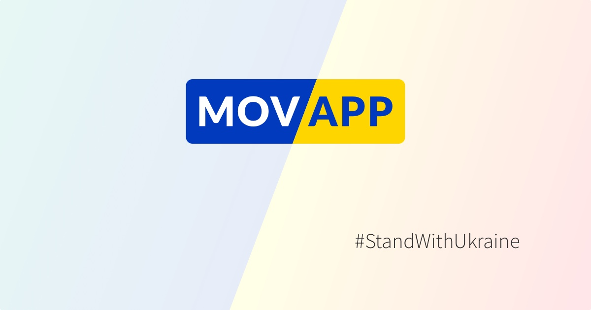

Cílem [Movapp.cz](Movapp.cz) je usnadnit dorozumění mezi Čechy a Ukrajinci. Mова [mova] znamená ukrajinsky jazyk. Movapp je aplikace pro trénink jazyků. 

Projekt vzniká v komunitě expertních dobrovolníků [Česko.Digital](https://cesko.digital). Kontakt: [pryvit@movapp.cz](mailto:pryvit@movapp.cz).

Zdrojový kód je pod MIT licencí. Texty, obrázky a audiosoubory jsou pod licencí CC BY-NC 4.0. Více na [LICENSE](LICENSE)

Chcete-li nám pomáhat na dalším rozvoji projektu, vyplňte formulář na [cesko.digital/join](https://cesko.digital/join) a přidejte se do Slacku na kanál `#ua-movaapp`.

# Použité technologie

- Kotlin + Android Jetpack